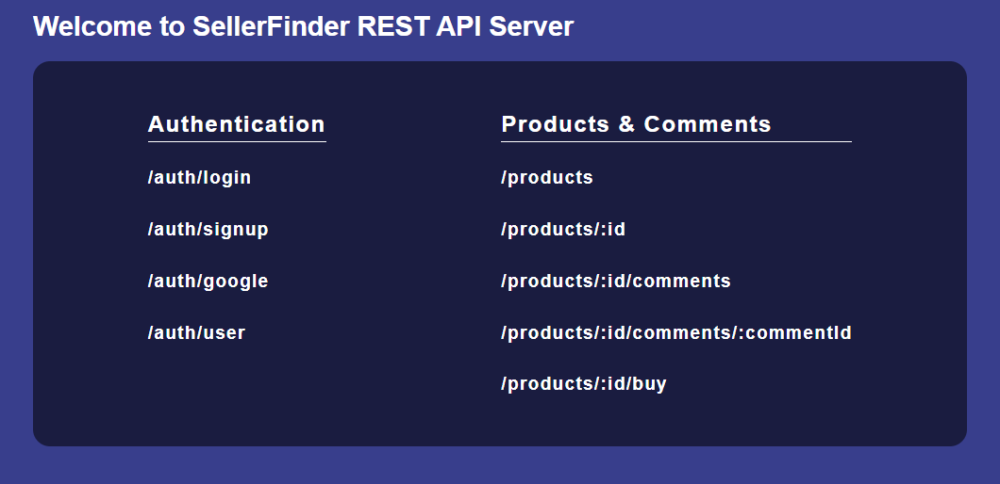
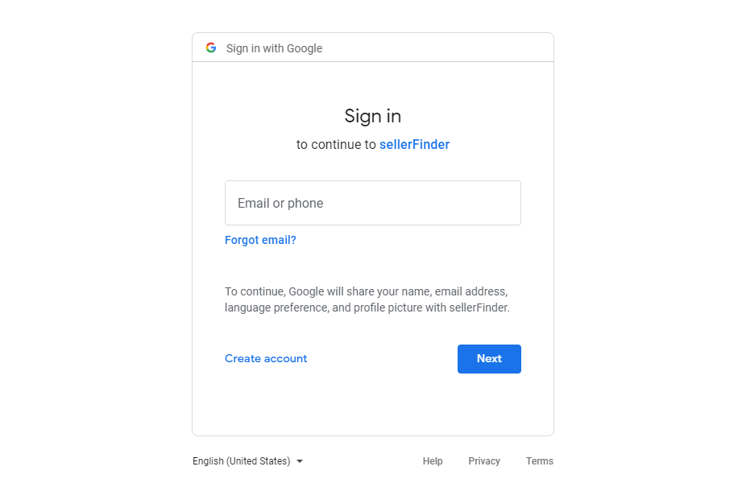
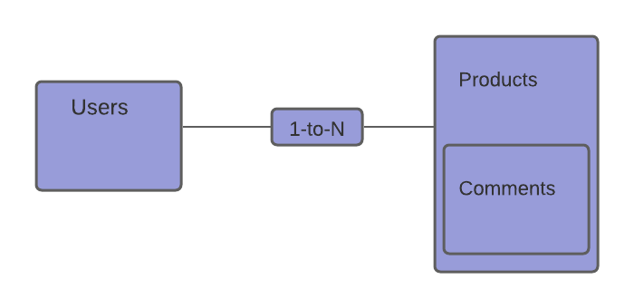

# SellerFinder REST API



Server project to conclude Server-side Development with NodeJS, Express and MongoDB on Coursera - Honors content, Project Implementation and Final Report.

## User Authentication



The server uses JWT token-based authentication, since it allows stateless server-side authentication. Once the user is logged in, an access token in send to the client so that future requests _Bear_ the token, either registering and signing in through local strategy or logging in using **Google OAuth** service.

> The authentication is made through Passport library, that performs Local, JWT and Google strategies.

## Pagar.me API

The "/:id/buy" Endpoint calls a service provider that makes a transaction through payment slip. This works making use of [Pagar.me API](https://docs.pagar.me/), an online payment service that allows signatures, credit cards, payment slip and much more. Once the payment slip is generated, the status of the transaction is settled as "processing", to simulate a payment in test environment another request can be done, passing the transaction id as a parameter URL. There are a lot of functionalities that can be performed by the API, as for example, send an email to the client notifying a slip to be paid, some of these functionally like this one is only for production environments. All the transactions made are available as a report in the Pagar.me Dashboard.

## Resources & data model

Products:

- Authenticated users can create, read, update and delete Products and Comments in a product.
- These actions follow business rules like only the user that is the owner of the product, can modify it.
- Role-based access control, only admin users can delete all the Comments in a Product.
- The server supports image upload for the products, through [multer library](https://github.com/expressjs/multer).

Data model:



> Comments are Subdocuments in Products Collection, Users Documents are ObjectIds referenced in Products and Comments.

## NestJs & ExpressJs

NestJs is a Node.js framework for building server-side applications, it is built on top of Express. The course's classes teache a lot of things about Express, like Middlewares, Authentication, Authorization, Static Files, HTTP, HTTPS, Mongo driver and so on. I've made use of Nest because I just wanted to learn a little on how to use NestJs. I've described some information about this framework [in this repository example.](https://github.com/NietoCurcio/Nestjs-REST-API-Example) and an overview of what is shown in the Server-side Development with NodeJS course in the [Confusion server project in the course](https://github.com/NietoCurcio/Confusion-REST-API-Server).

## Requirements

- NodeJs.
- MongoDB local service or Atlas cloud database service.
- Google OAuth project registration.

## About Course and SellerFinder idea

This server is the server-side development of a project ideation since the [SellerFinder client-side development](https://github.com/NietoCurcio/SellerFinder). Both are part of the "Architecture Design and Software Structure Report" and "Project implementation in Full stack Web development with React specialization on Coursera.

<hr>

<p align="center">
  <a href="http://nestjs.com/" target="blank"></a>
</p>

[circleci-image]: https://img.shields.io/circleci/build/github/nestjs/nest/master?token=abc123def456
[circleci-url]: https://circleci.com/gh/nestjs/nest

  <p align="center">A progressive <a href="http://nodejs.org" target="_blank">Node.js</a> framework for building efficient and scalable server-side applications.</p>
    <p align="center">
<a href="https://www.npmjs.com/~nestjscore" target="_blank"></a>
<a href="https://www.npmjs.com/~nestjscore" target="_blank"></a>
<a href="https://www.npmjs.com/~nestjscore" target="_blank"></a>
<a href="https://circleci.com/gh/nestjs/nest" target="_blank"></a>
<a href="https://coveralls.io/github/nestjs/nest?branch=master" target="_blank"></a>
<a href="https://discord.gg/G7Qnnhy" target="_blank"></a>
<a href="https://opencollective.com/nest#backer" target="_blank"></a>
<a href="https://opencollective.com/nest#sponsor" target="_blank"></a>
  <a href="https://paypal.me/kamilmysliwiec" target="_blank"></a>
    <a href="https://opencollective.com/nest#sponsor"  target="_blank"></a>
  <a href="https://twitter.com/nestframework" target="_blank"></a>
</p>
  <!--[](https://opencollective.com/nest#backer)
  [](https://opencollective.com/nest#sponsor)-->

## Description

[Nest](https://github.com/nestjs/nest) framework TypeScript starter repository.

## Installation

```bash
$ npm install
```

## Running the app

```bash
# development
$ npm run start

# watch mode
$ npm run start:dev

# production mode
$ npm run start:prod
```

## Test

```bash
# unit tests
$ npm run test

# e2e tests
$ npm run test:e2e

# test coverage
$ npm run test:cov
```

## Support

Nest is an MIT-licensed open source project. It can grow thanks to the sponsors and support by the amazing backers. If you'd like to join them, please [read more here](https://docs.nestjs.com/support).

## Stay in touch

- Author - [Kamil Myśliwiec](https://kamilmysliwiec.com)
- Website - [https://nestjs.com](https://nestjs.com/)
- Twitter - [@nestframework](https://twitter.com/nestframework)

## License

Nest is [MIT licensed](LICENSE).
